# 🏗️ CareerLens Architecture

```mermaid
graph TD
    subgraph Client[🖥️ Frontend - React Application]
        A[📱 User Interface] --> B[Components]
        B --> B1[Resume Upload]
        B --> B2[Job Search]
        B --> B3[Application Tracker]
        B --> B4[Calendar View]
        B --> B5[Authentication]
        
        C[📡 API Services] --> D[Axios HTTP Client]
        
        E[🔐 Auth Context] --> F[JWT Management]
    end

    subgraph Server[⚙️ Backend - Express Server]
        G[🛣️ Routes] --> G1[Auth Routes]
        G --> G2[Upload Routes]
        G --> G3[Analyze Routes]
        G --> G4[Jobs Routes]
        G --> G5[Applications Routes]
        
        H[🔒 Middleware] --> H1[Auth Middleware]
        H --> H2[File Upload]
        
        I[📊 Controllers] --> I1[User Controller]
        I --> I2[Resume Controller]
        I --> I3[Job Controller]
        
        J[💾 Models] --> J1[User Model]
        J --> J2[Application Model]
        J --> J3[Job Model]
    end

    subgraph External[🌐 External Services]
        K[OpenAI API]
        L[DeepSeek API]
        M[Jooble API]
    end

    subgraph Database[🗄️ Database]
        N[MongoDB Atlas]
    end

    %% Connections
    D --> G
    G --> I
    I --> J
    J --> N
    I --> External
    H --> G

    style Client fill:#1e293b,stroke:#60a5fa,stroke-width:2px
    style Server fill:#1e293b,stroke:#34d399,stroke-width:2px
    style External fill:#1e293b,stroke:#f472b6,stroke-width:2px
    style Database fill:#1e293b,stroke:#fbbf24,stroke-width:2px
```



## 🔍 Detailed Component Overview

### 🖥️ Frontend Components

1. **User Interface Components**
   - Resume Upload: Handles file uploads (PDF, DOC, DOCX)
   - Job Search: Integrates with job search APIs
   - Application Tracker: Manages job applications
   - Calendar View: Visualizes application timeline
   - Authentication: Handles user login/registration

2. **Services Layer**
   - API Services: Manages all backend communication
   - Auth Context: Handles authentication state
   - JWT Management: Manages authentication tokens

### ⚙️ Backend Components

1. **Routes**
   - Auth Routes: User authentication endpoints
   - Upload Routes: File upload handling
   - Analyze Routes: Resume analysis
   - Jobs Routes: Job search and management
   - Applications Routes: Application tracking

2. **Middleware**
   - Auth Middleware: JWT verification
   - File Upload: Multer configuration
   - Error Handling: Global error management

3. **Controllers**
   - User Controller: User management logic
   - Resume Controller: Resume processing
   - Job Controller: Job search and matching

4. **Models**
   - User Model: User data schema
   - Application Model: Job application schema
   - Job Model: Job listing schema

### 🌐 External Services Integration

1. **AI Services**
   - OpenAI API: Primary resume analysis
   - DeepSeek API: Alternative analysis service

2. **Job Search**
   - Jooble API: Job listing provider

### 🗄️ Database

- MongoDB Atlas: Cloud-hosted database service
- Mongoose ODM: Database interaction layer

## 🔄 Data Flow

1. **Resume Analysis Flow**
   ```mermaid
   sequenceDiagram
       participant User
       participant Frontend
       participant Backend
       participant AI Services
       participant Database

       User->>Frontend: Upload Resume
       Frontend->>Backend: Send File
       Backend->>AI Services: Request Analysis
       AI Services-->>Backend: Analysis Results
       Backend->>Database: Store Results
       Backend-->>Frontend: Return Analysis
       Frontend-->>User: Display Results
   ```

2. **Job Search Flow**
   ```mermaid
   sequenceDiagram
       participant User
       participant Frontend
       participant Backend
       participant Jooble API
       participant Database

       User->>Frontend: Search Jobs
       Frontend->>Backend: Search Request
       Backend->>Jooble API: API Request
       Jooble API-->>Backend: Job Listings
       Backend->>Database: Cache Results
       Backend-->>Frontend: Return Jobs
       Frontend-->>User: Display Listings
   ```

## 🔐 Security Measures

1. **Authentication**
   - JWT-based authentication
   - Password hashing with bcrypt
   - Secure session management

2. **Data Protection**
   - CORS configuration
   - Environment variable protection
   - Input validation and sanitization

## 🚀 Deployment Architecture

```mermaid
graph LR
    subgraph Production[Production Environment]
        A[Netlify] --> B[Frontend]
        C[Render.com] --> D[Backend]
        E[MongoDB Atlas] --> F[Database]
    end

    style Production fill:#1e293b,stroke:#60a5fa,stroke-width:2px
``` 

