# CareerLens Application Architecture

```mermaid
graph LR
    %% Define main components
    User((👤 User))
    Browser[🌐 Browser]
    
    subgraph ClientSide[Client Side]
        style ClientSide fill:#e8f5e9,stroke:#4caf50,stroke-width:2px
        React[React Framework]
        
        subgraph FrontendPackages[Third Party Packages]
            style FrontendPackages fill:#f3e5f5,stroke:#9c27b0,stroke-width:1px
            Packages["
                @mui/material
                @emotion/react
                @fullcalendar
                axios
                react-router-dom
                JWT management
            "]
        end
    end
    
    subgraph ServerSide[Server Side]
        style ServerSide fill:#ffebee,stroke:#f44336,stroke-width:2px
        Express[Express Framework]
        
        subgraph BackendPackages[Third Party Packages]
            style BackendPackages fill:#e3f2fd,stroke:#2196f3,stroke-width:1px
            ServerPackages["
                express
                mongoose
                multer
                bcryptjs
                jsonwebtoken
                pdf-parse
            "]
        end
    end
    
    subgraph ExternalAPIs[External APIs]
        style ExternalAPIs fill:#fff3e0,stroke:#ff9800,stroke-width:2px
        APIs["
            OpenAI - Resume Analysis
            DeepSeek - AI Processing
            Jooble - Job Search
        "]
    end
    
    subgraph Database[Database Layer]
        style Database fill:#fce4ec,stroke:#e91e63,stroke-width:2px
        MongoDB[(MongoDB Atlas)]
    end
    
    %% Define connections with labels
    User -->|Web Address| Browser
    Browser -->|HTTP Request| ClientSide
    ClientSide -->|API Request| ServerSide
    ServerSide -->|API Response| ClientSide
    ServerSide -->|Mongoose Query| Database
    Database -->|Data| ServerSide
    ServerSide -->|API Requests| ExternalAPIs
    ExternalAPIs -->|API Response| ServerSide
    Browser -->|HTML/JSON| User

    %% Style nodes
    style User fill:#bbdefb,stroke:#1976d2,stroke-width:2px
    style Browser fill:#c8e6c9,stroke:#388e3c,stroke-width:2px
    style React fill:#b2dfdb,stroke:#00796b,stroke-width:2px
    style Express fill:#ffcdd2,stroke:#d32f2f,stroke-width:2px
    style MongoDB fill:#f8bbd0,stroke:#c2185b,stroke-width:2px
```

## 🔍 System Components

### 👤 User Layer
- Web browser access
- User interface interaction
- Form submissions and file uploads

### 🌐 Client Side (Frontend)
- **Framework**: React
- **Key Features**:
  - Responsive UI with Material-UI
  - State management
  - Route handling
  - API integration
  - File upload handling
  - Real-time updates

### ⚙️ Server Side (Backend)
- **Framework**: Express.js
- **Key Features**:
  - RESTful API endpoints
  - Authentication & Authorization
  - File processing
  - Data validation
  - Error handling
  - External API integration

### 🗄️ Database Layer
- **Technology**: MongoDB Atlas
- **Features**:
  - Cloud hosting
  - Scalable storage
  - Data redundancy
  - Automated backups
  - Security compliance

### 🔌 External Services
- **OpenAI API**: Resume analysis and skill extraction
- **DeepSeek API**: Advanced AI processing
- **Jooble API**: Job search and listings

## 🔄 Data Flow Architecture

```mermaid
sequenceDiagram
    participant User as 👤 User
    participant Frontend as 🎨 Frontend
    participant Backend as ⚙️ Backend
    participant External as 🌐 External APIs
    participant DB as 💾 Database

    User->>Frontend: 1. Access Application
    Frontend->>Backend: 2. API Request
    Backend->>External: 3. External Service Call
    External-->>Backend: 4. Service Response
    Backend->>DB: 5. Store Data
    DB-->>Backend: 6. Data Response
    Backend-->>Frontend: 7. API Response
    Frontend-->>User: 8. Display Results

    note over Frontend,Backend: Secure Communication via JWT
    note over Backend,DB: Mongoose ODM Layer
    note over Backend,External: API Integration Layer
```

## 🛡️ Security Architecture

## 🚀 Deployment Architecture

